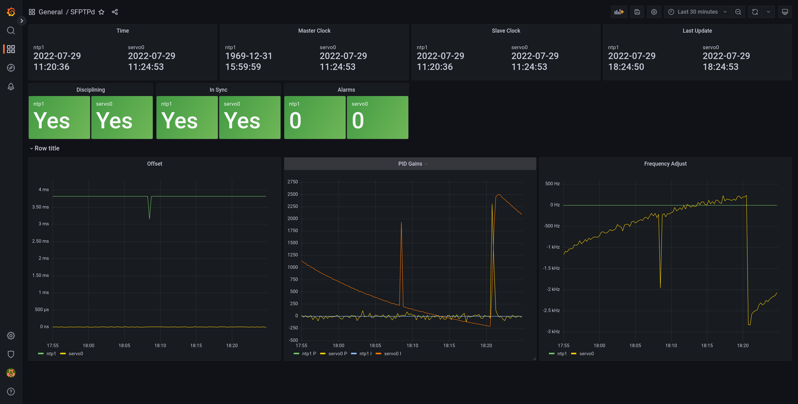

# Prometheus exporter for [sfptpd](https://www.xilinx.com/support/download/nic-software-and-drivers.html#linux)

[](https://github.com/natesales/sfptpd-exporter/releases)
[](https://goreportcard.com/report/github.com/natesales/sfptpd-exporter)
[](https://raw.githubusercontent.com/natesales/sfptpd-exporter/main/LICENSE)

### Grafana



A simple dashboard is available to [import into Grafana](https://grafana.com/docs/grafana/latest/dashboards/export-import/#import-dashboard) from the sfptpd-exporter [Grafana JSON file](https://raw.githubusercontent.com/natesales/sfptpd-exporter/main/grafana-dashboard.json).

### Quickstart

#### Linux

Install `sfptpd-exporter` from the [apt/yum repo](https://github.com/natesales/repo) or build with `go build`

```bash
$ sfptpd-exporter
INFO[0000] Starting sfptpd-exporter version dev stats from /tmp/sfptpd_stats.jsonl
INFO[0000] Starting metrics exporter on :9979/metrics
```

#### Docker

```bash
docker run -p 9978:9978 ghcr.io/natesales/sfptpd-exporter
``` 

### Usage

```bash
Usage of ./sfptpd-exporter:
  -f string
        sfptpd stats JSONL file (default "/tmp/sfptpd_stats.jsonl")
  -l string
        metrics listen address (default ":9979")
  -v    Enable verbose logging
  -vv
        Enable extra verbose logging
```
